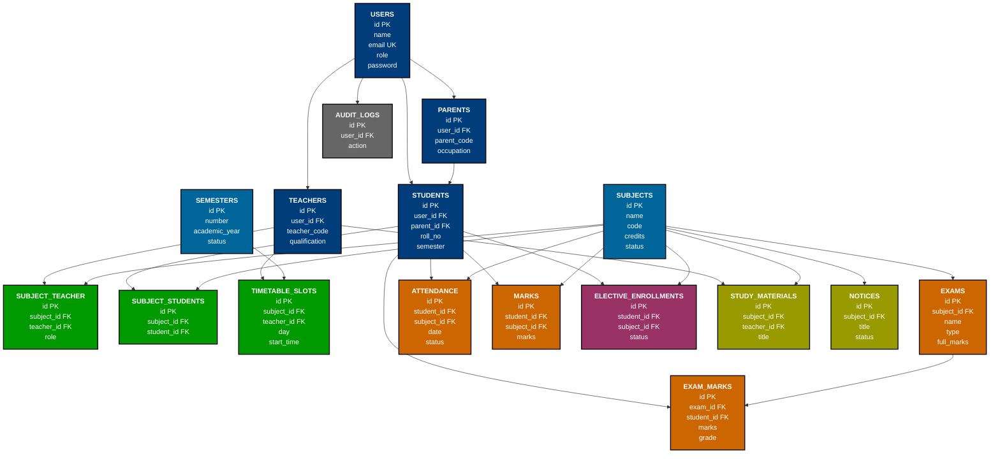

# IT-DMS Database ER Diagram (Hierarchical)

## Mermaid Diagram Code

## How to View

### Online
- Use [Mermaid Live Editor](https://mermaid.live/)
- Paste the diagram code above

### VS Code
- Install "Markdown Preview Mermaid Support" extension
- Open this file in VS Code preview

### GitHub
- Upload this file to GitHub - Mermaid renders automatically

## Entity Layers

### Layer 1: User Management (Dark Blue)
- **USERS**: Core user entity with role-based access
- **TEACHERS**: Teacher profile
- **PARENTS**: Parent profile
- **STUDENTS**: Student profile
- **AUDIT_LOGS**: System audit trail

### Layer 2: Academic Core (Light Blue)
- **SUBJECTS**: All subjects offered
- **SEMESTERS**: Semester information

### Layer 3: Relationship Tables (Green)
- **SUBJECT_TEACHER**: Maps teachers to subjects
- **SUBJECT_STUDENTS**: Maps students to subjects
- **TIMETABLE_SLOTS**: Class scheduling

### Layer 4: Assessment (Orange)
- **EXAMS**: Exam details
- **EXAM_MARKS**: Exam results
- **MARKS**: General marks
- **ATTENDANCE**: Attendance tracking

### Layer 5: Operations (Purple & Yellow)
- **ELECTIVE_ENROLLMENTS**: Student elective requests
- **STUDY_MATERIALS**: Course materials
- **NOTICES**: System notices

## Relationships Summary

| From | To | Type | Description |
|------|-----|------|-------------|
| USERS | TEACHERS | 1:1 | Each teacher has one user account |
| USERS | PARENTS | 1:1 | Each parent has one user account |
| USERS | STUDENTS | 1:1 | Each student has one user account |
| USERS | AUDIT_LOGS | 1:N | Each user can have multiple audit logs |
| PARENTS | STUDENTS | 1:N | Each parent can have multiple children |
| TEACHERS | SUBJECT_TEACHER | 1:N | Each teacher can teach multiple subjects |
| TEACHERS | TIMETABLE_SLOTS | 1:N | Each teacher has multiple slots |
| TEACHERS | STUDY_MATERIALS | 1:N | Each teacher uploads multiple materials |
| STUDENTS | SUBJECT_STUDENTS | 1:N | Each student enrolls in multiple subjects |
| STUDENTS | ATTENDANCE | 1:N | Each student has multiple attendance records |
| STUDENTS | MARKS | 1:N | Each student has multiple marks |
| STUDENTS | EXAM_MARKS | 1:N | Each student takes multiple exams |
| STUDENTS | ELECTIVE_ENROLLMENTS | 1:N | Each student can enroll in multiple electives |
| SUBJECTS | SUBJECT_TEACHER | 1:N | Each subject is taught by multiple teachers |
| SUBJECTS | SUBJECT_STUDENTS | 1:N | Each subject has multiple students |
| SUBJECTS | EXAMS | 1:N | Each subject can have multiple exams |
| SUBJECTS | ATTENDANCE | 1:N | Each subject tracks multiple attendances |
| SUBJECTS | MARKS | 1:N | Each subject has multiple marks |
| SUBJECTS | TIMETABLE_SLOTS | 1:N | Each subject has multiple time slots |
| SUBJECTS | STUDY_MATERIALS | 1:N | Each subject has multiple study materials |
| SUBJECTS | ELECTIVE_ENROLLMENTS | 1:N | Each subject can be enrolled as elective |
| SUBJECTS | NOTICES | 1:N | Each subject can have multiple notices |
| SEMESTERS | TIMETABLE_SLOTS | 1:N | Each semester has multiple timetable slots |
| EXAMS | EXAM_MARKS | 1:N | Each exam has multiple marks |
