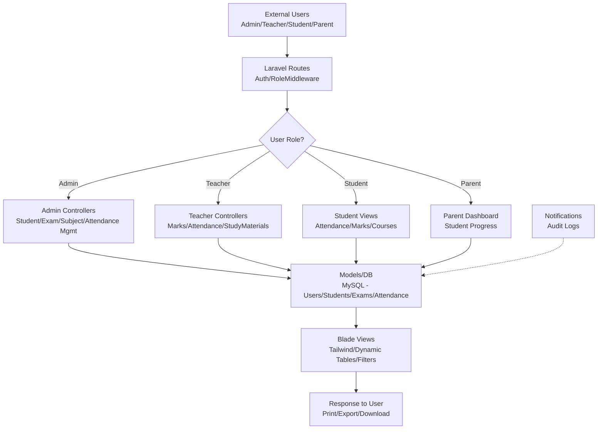
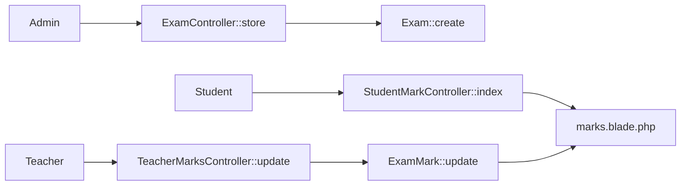

# IT-DMS TL;DR
## Overview
Laravel-based **IT Department Management System (ERP)** for college/university IT dept.

**Roles**: Admin, Teacher, Student, Parent  
**Core Features**:
- ✅ Student/Teacher/Parent profiles & management
- ✅ Subject allocation, electives, timetable
- ✅ Attendance tracking (per subject/student)
- ✅ Exam creation, marks entry (internal/final/assessment), marksheets
- ✅ Study materials upload/download
- ✅ Notice board (bilingual English/Nepali)
- ✅ Gallery, reports, printing (HTML-to-image)
- ✅ Role-based dashboards, filters, exports (CSV/Excel)
- 🔄 Notifications, audit logs

**Tech**: Laravel 11+, MySQL, Tailwind CSS, Livewire/Alpine.js, Bilingual support (BS dates)

## Quick Start
```bash
php artisan migrate --seed
php artisan serve
# Visit localhost:8000
```

**Key Models/Tables**: 15+ (User polymorphic → Student/Teacher/Parent, Subject↔Student/Teacher pivots, Exam→ExamMark, Attendance)

## ER Diagram (Mermaid)
```mermaid
erDiagram
    USER ||--o{ STUDENT : hasOne
    USER ||--o{ TEACHER : hasOne
    USER ||--o{ PARENTMODEL : hasOne
    STUDENT }|--|| SUBJECT : enrolls (subject_students)
    TEACHER }o--|| SUBJECT : teaches (subject_teacher)
    SUBJECT ||--o{ EXAM : has
    EXAM ||--o{ EXAMMARK : has
    EXAMMARK }|--|| STUDENT : for
    STUDENT ||--o{ ATTENDANCE : has
    ATTENDANCE }|--|| SUBJECT : for
    SUBJECT ||--o{ STUDYMATERIAL : has
    SUBJECT ||--o{ TIMETABLESLOT : has
    USER ||--o{ NOTICE : creates
    USER ||--o{ AUDITLOG : performs
    COLLEGE {
        id PK
        name
    }
    SEMESTER {
        number
        start_date
    }
```

## Data Flow Diagram (Mermaid - Level 0)


## Data Flow - Marks Management Example


## File Structure Highlights
```
├── app/Models/       # User,Student,Teacher,Subject,Exam,Attendance,...
├── app/Http/Controllers/Admin/  # Core CRUD
├── app/Http/Controllers/Teacher/ # Read-only + marks entry
├── database/migrations/ # 30+ tables
├── resources/views/admin/ # Dynamic tables, prints
├── resources/views/teacher/ # Dashboard, marks entry
└── routes/web.php    # Role prefixed routes
```

**Production Ready**: Seeding, migrations, role auth, responsive, print utils.
**Extensible**: Add new roles/features via middleware + controllers + models.

